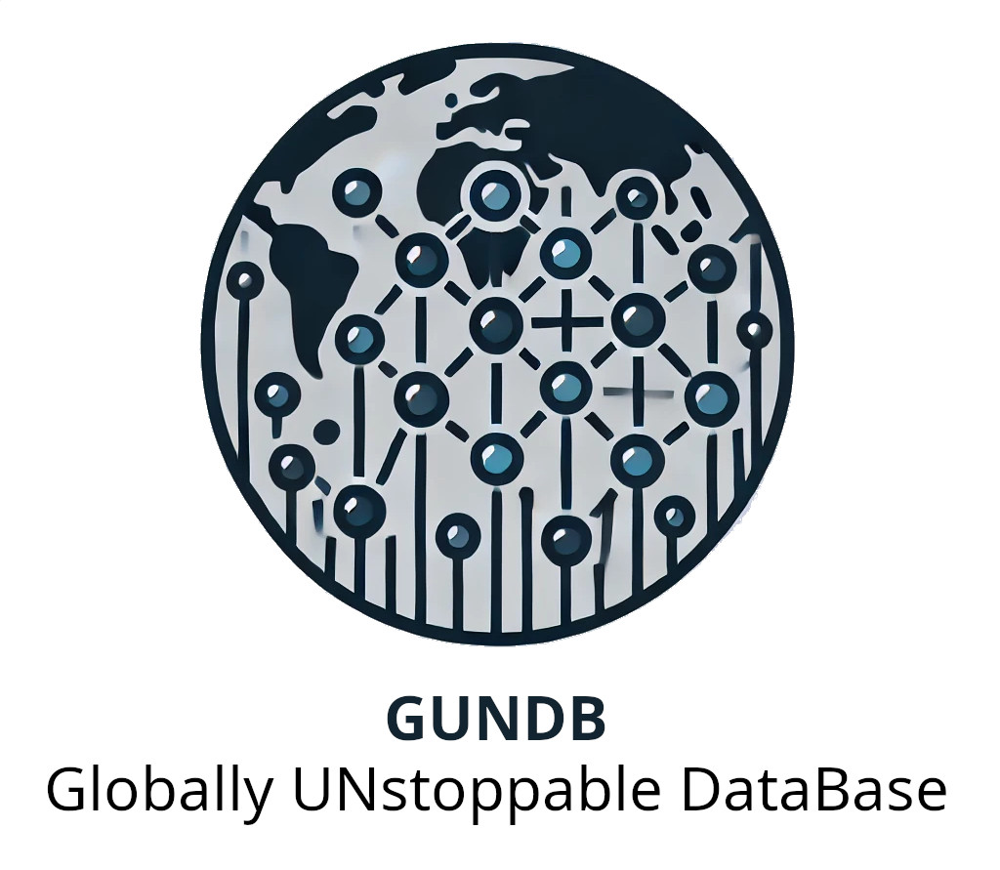

# GunDB



## Overview

**WIP**

**GunDB** (Globally UNstoppable DataBase) is a pioneering database solution designed to be **always locally writeable**, **multi-master**, and **conflict-free** with **global replicated event sourcing**. Built with resilience and scalability in mind, Gundb aims to provide a seamless and uninterrupted data experience across distributed systems.  Use cases include resilient local operation and recovery during power failures, wars, embassies under siege... and just when you never want to lose your database, or never want to deal with split-brain recovery scenarios, or multiple customers with split-brain recovery scenarios.

## Features

- **Always Locally Writeable**: Perform write operations locally without waiting for global consensus, ensuring low latency and high availability.
- **Multi-Master Architecture**: Multiple masters can handle write operations simultaneously, facilitating horizontal scalability and fault tolerance.
- **Lightweight**: run on servers backed by postgres, or IoT backed by key-value index files.  Your call.
- **Arbitrary topology**: Run it on servers remotely AND key-value index files on IoT.  Run three nodes locally and/or five nodes over five WANs. Your call. Unlike some globally replicated database solutions, GunDB doesn't dictate crazy things like 3 highly available database per site and redundant low-latency WAN links.
- **Conflict-Free Replicated Data Types (CRDTs)**: Guarantees eventual consistency without the complexities of conflict resolution.
- **Global Event Sourcing**: Captures all changes as a sequence of events, enabling auditability, rollback capabilities, and real-time data processing.
- **Arbitrary data synchronization methods**: the actual synchronization method between nodes doesn't matter to the core design; it's a simple, abstract interface for which many implementations are possible. They could vary from high-speed WANs with financial data, custom XML data embedded in RSS feeds, email attachments, or occasional updates on tape. The first implementation will proably be gRPC, though... or something like that.

## Current Status

Gundb is currently an **early Work-In-Progress (WIP)** and a **Proof of Concept (POC)**. The core functionality revolves around a **SQLAlchemy-based declarative EventStream system**, which serves as the foundation for Gundb's event sourcing mechanism.

### Placeholder Main Function

The `main()` function included in the project serves as a **placeholder** for now. It demonstrates the basic setup and usage of the EventStream system. A dedicated **gundb wrapper script** has been created to facilitate future enhancements and integrations.

## Roadmap

Gundb is actively under development, with plans to evolve into a comprehensive utility for:

- **Monitoring Streams**: Real-time monitoring and management of data streams across distributed nodes.
- **Communication between nodes**: This is just an abstract interface right now.  We'll probably start with simply sending & receiving events over gRPC or something like that.  The core design means that the methods for doing this are not very important: we could make it work over email or subscriptions to RSS-like XML updates, even (but we won't).
- **Comprehensive Documentation and Examples**: Detailed guides and use-case examples to assist developers in integrating and utilizing Gundb effectively.

## Building and Installation

GunDB utilizes [Poetry](https://python-poetry.org/) for building. Follow the steps below to set up GunDB on your local machine.

### Prerequisites

- **Python 3.9+**: Ensure Python is installed. You can download it from [here](https://www.python.org/downloads/).
- **Poetry**: Install Poetry by following the [official installation guide](https://python-poetry.org/docs/#installation).

### Steps

1. **Clone the Repository**

    ```bash
    git clone https://github.com/yourusername/gundb.git
    cd gundb
    ```

2. **Install Dependencies**

    ```bash
    poetry install
    ```

3. **Activate the Virtual Environment**

    ```bash
    poetry shell
    ```

## Usage

As GunDB is in its early stages, the current usage revolves around the provided `gundb` executable (a wrapper script around `gundb.__main__.py`, created during `poetry install`), which demonstrates the creation of event streams, events, and updating views.

## Author

[Lee Braiden](mailto:lee.braiden@pm.me)

## Contributing

Contributions welcome! Open tickets or PR's at https://github.com/lee-b/gundb/.

## LICENSE

Aferro General Public License, version 3.  Contact the [Lee Braiden](mailto:lee.braiden@pm.me) if you need to discuss other licensing options.
