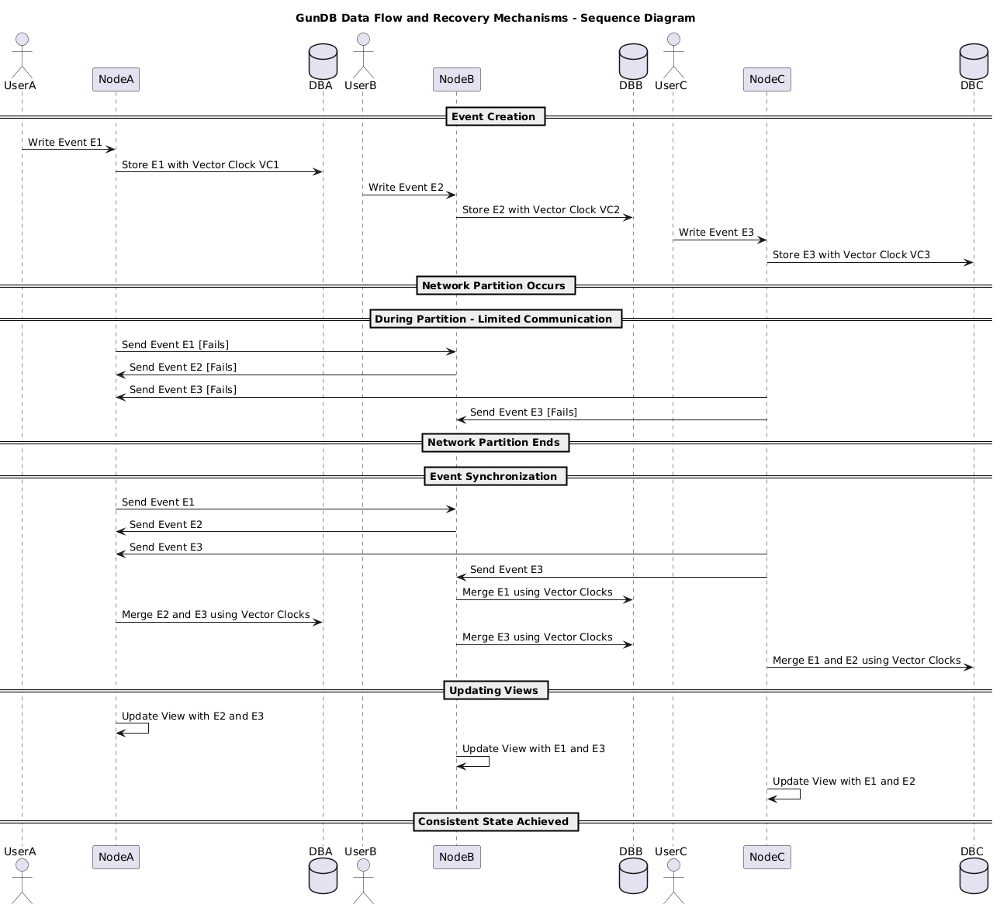

# GunDB: Theory of Operation

## 1. Core Concept: Conflict-Free Replication using Vector Clocks

At the heart of GunDB is the implementation of conflict-free replication using vector clocks. This approach allows for a distributed system where multiple nodes can make updates independently, while still maintaining a consistent global state.

### Vector Clocks:
- Implemented in the `VectorClock` class (`vector_clock.py`)
- Each event in the system is associated with a vector clock
- Vector clocks are represented as dictionaries, where keys are stream IDs and values are integer counters.
- The idea is that you build tools/services that track the latest eventsource ids of event types that they are basing their creation of new events on. Events are per source site (each of which has a uuid) where the Event originated, avoiding the need to synchronise/know the latest EventStream clock value between sites before adding new Events.
- These counters or "clocks" per source site EventStream are your dependencies for events that you create.  So long as your Event is after the events it depends on (and your business logic is not broken) all is good.
- Thus, we can sort all Events in order of dependency, globally, and per site, according to whatever site-to-site connectivity any given site/node has at any given time.  
- The `VectorClock` class provides methods for incrementing clocks, comparing events, and sorting events based on their causal relationships

### Key operations:
- `increment(stream_id)`: Increases the counter for a specific stream
- `_happened_before(vc1, vc2)`: Determines if one vector clock precedes another
- `sort_events(events)`: Sorts a list of events based on their causal relationships

This implementation allows GunDB to handle concurrent updates across multiple nodes and determine the correct order of events, even in the face of network partitions or delays.

## 2. SQLAlchemy Base Classes: EventStream and Event

GunDB simplifies the interface for working with event sourcing through the use of SQLAlchemy base classes:

### EventStream (`models.py`):
- Base class for all event streams
- Each stream type inherits from this class and provides a unique UUID
- Represents a sequence of related events

### Event (`models.py`):
- Base class for all events
- Connected to an `EventStream` via a foreign key
- Contains the actual data of the change, along with its associated vector clock

These base classes provide a high-level abstraction for working with event sourcing, hiding the complexities of managing individual events and their relationships.

## 3. View Class

The `View` class (`models.py`) represents the current state of a stream, updated by applying events. This allows for efficient querying of the current state without having to replay all events every time.

### Key method:
- `apply_event(event)`: Updates the view's state based on an incoming event

## 4. Node Classes: EventSourceNode and EventSinkNode

GunDB introduces abstract base classes for nodes that can send and receive events:

### EventSourceNode (`nodes.py`):
- Abstract base class for nodes that send events
- Defines the `send_event` method

### EventSinkNode (`nodes.py`):
- Abstract base class for nodes that receive events
- Defines the `receive_event` method

These classes provide a framework for implementing the network communication layer of GunDB, allowing for easy integration of different network protocols or transport mechanisms.

## 5. User-Friendly Abstractions

By combining these components, GunDB provides a user-friendly interface for building distributed, conflict-free applications:

- Developers can define custom event streams and events by inheriting from the base classes
- The system handles the complexities of vector clocks and event ordering behind the scenes
- Views provide an easy way to query the current state of the system
- The node classes offer a simple interface for sending and receiving events across the network

This abstraction layer allows developers to focus on their application logic without having to directly manage the intricacies of global replication, CRDTs, or the CAP theorem. The system ensures that data is always locally available for writing and that conflicts are resolved automatically using the vector clock mechanism.

In summary, GunDB combines the power of event sourcing, vector clocks, and SQLAlchemy to provide a robust foundation for building distributed, conflict-free database systems. The carefully designed abstractions make it accessible to developers while handling the complex distributed systems challenges under the hood.

## 6. Business Logic consistency

So long as the Events themselves do not allow creating logically inconsistent field values (such as Person with the status 'dead' later being assigned the status 'alive' **based upon the source events visible to you**) then (theoretically, at least; bug reports welcome!) there is no chance of conflict or inconsistent data.  Note that this is a business logic requirement though, and not core to gundb's operation.

## 7. Total Ordering and State Management in EventStreams

### Total Ordering in EventStreams
GunDB enforces a **total order** within each `EventStream`, ensuring that all events in a stream form a clear, linear sequence with no concurrent events allowed. Unlike standard vector clock implementations where concurrent events (lacking a causal 'happened-before' relationship) are common in distributed systems, GunDB rejects concurrent events during sorting (see `VectorClock.sort_events()`). This design guarantees that events can be processed or replayed in a consistent order across all nodes, providing deterministic state reconstruction and avoiding conflicts due to concurrency.

### Flattening to Database Records/Tables
Events within an `EventStream` can be sequentially applied to construct or update database records or tables, a process referred to as "flattening." Each event represents a change or update to the state of an entity, and by processing the stream in its total order, the system builds the current state of a record or table. This is implemented through the `View` class, which maintains an up-to-date snapshot of the state by applying events as they are received. The result is a flattened representation of the stream as a single, current database entry or set of entries.

### Unflattening to Events
Conversely, GunDB supports "unflattening" by retrieving the stored sequence of events from an `EventStream` and replaying them as individual updates. This allows for auditing, debugging, or reconstructing the history of changes to a record or table. Each event in the stream represents a discrete update, enabling the system to break down the current state into its constituent changes over time.

### Comparison to Apache Kafka
This design is conceptually similar to Apache Kafka, a distributed streaming platform where events (messages) are stored in topics as an ordered log. In Kafka, each partition of a topic maintains a total order, allowing consumers to process events sequentially to build application state (flattening) or analyze historical data (unflattening). GunDB's `EventStreams` mirror Kafka's log-based approach by persisting events in a totally ordered sequence, ensuring consistency and replayability. However, unlike Kafka, which relies on offsets and timestamps for ordering, GunDB uses vector clocks to manage causality in a distributed environment, with additional logic to enforce total ordering by rejecting concurrent events.

This architecture provides a robust foundation for distributed data consistency, state management, and event-driven processing, tailored to ensure deterministic outcomes in a decentralized system.
